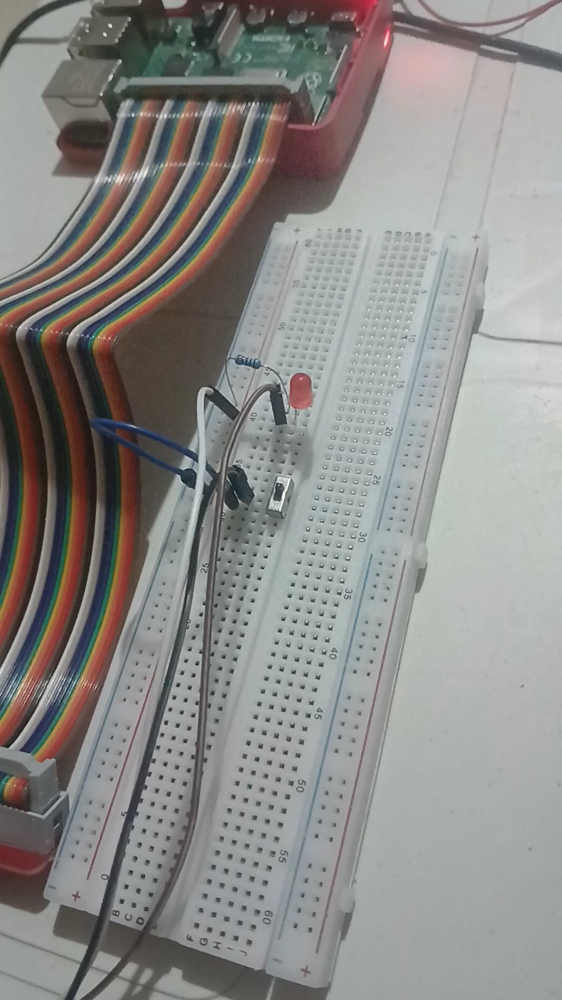

## Toggle Button Using WiringPi (C, CMake, Toolchain)

This project demonstrates how to use a toggle button with WiringPi in C++ on a Raspberry Pi. The toggle button will switch between two states (ON/OFF) when pressed. The following tools and technologies were used:
- **WiringPi**: A GPIO library for the Raspberry Pi.
- **CMake**: For build configuration.
- **Toolchain**: Cross-compiling from a host machine to the Raspberry Pi using a custom toolchain.

### Features:
- Detects button presses on a GPIO pin.
- Toggles an LED or other connected components between ON and OFF states.
- Uses WiringPi functions to manage GPIO inputs and outputs.
- Cross-compiled from a host system and deployed to Raspberry Pi via SSH.

### Image of the Setup

### Watch the Demo

[Watch the video demonstration of the toggle button functionality](https://www.youtube.com/shorts/nslXd3A5AVQ)
